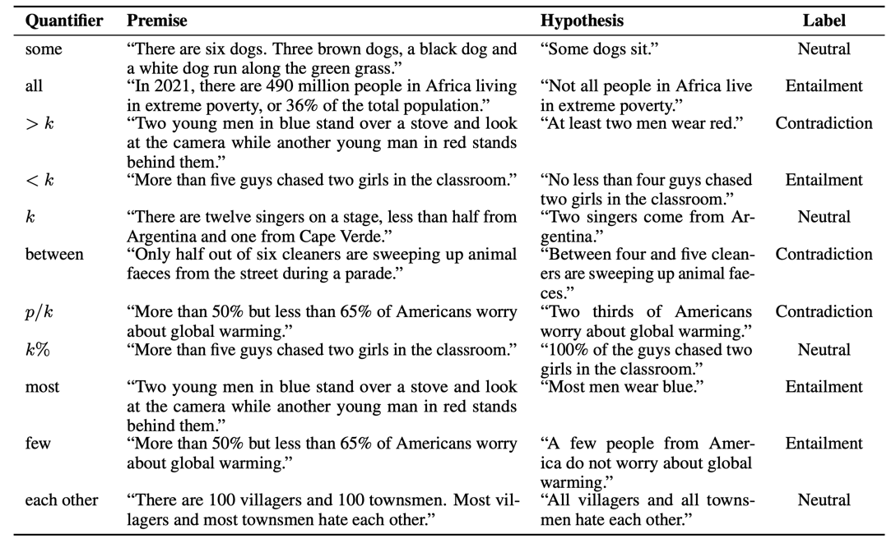

# GQNLI: The Generalized Quantifier NLI Challenge Dataset
GQNLI is an evaluation corpus that is aimed for testing language model's generalized quantifier reasoning ability (1.0: in English).

## Introduction
Logical approaches to representing language have developed and evaluated computational models of quantifier words since the 19th century, but today's NLU models still struggle to capture their semantics. 

We rely on Generalized Quantifier Theory for language-independent representations of the semantics of quantifier words, to quantify their contribution to the errors of NLU models. 

We find that quantifiers are pervasive in NLU benchmarks, and their occurrence at test time is associated with performance drops. 

To facilitate directly-targeted probing, we present an adversarial generalized quantifier NLI task (GQNLI) and show that pre-trained language models have a clear lack of robustness in generalized quantifier reasoning.

## The GQNLI Corpus
GQNLI is a generalized quantifier NLI challenge dataset, consisting of 30 premises and 300 hypotheses. 

To choose the premises, we first randomly sampled 100 premises with GQs from [SNLI](https://nlp.stanford.edu/projects/snli/) and [ANLI](https://github.com/facebookresearch/anli) test sets, respectively, and selected 10 premises in total, that we consider are semantically adequate for adding GQs and making simple hypotheses.

To construct the hypotheses, we rely on RoBERTa fine-tuned on MNLI, and manually select examples about which the model is unsure or incorrect. The labels are uniformed distributed.

We augmented the examples by two times by substituting non-quantifier words (e.g., replacing "dogs" with "cats") while keeping the labels, to exclude the effect of specific lexical items.



## Download
Version 1.0 is available and stored under this repository named `gqnli-1.0.zip`.
## Leaderboard
If you want to have your model added to the leaderboard, please reach out to us.

| **Model**         | **Training Data**          | **% Accuracy** |
| :---------------- | :------------------------- | :------------: |
| DeBERTa-v3 (base) | MNLI, FeverNLI, LingNLI, DocNLI   | 42\.7      |
| ALBERT (xxlarge)  | SNLI, MNLI, FeverNLI, ANLI | 42             |
| BART (large)      | SNLI, MNLI, FeverNLI, ANLI | 41\.7          |
| DeBERTa-v3 (base) | MNLI, FeverNLI, ANLI       | 41\.3          |
| DeBERTa-v3 (base) | MNLI                       | 40\.7          |
| RoBERTa (large)   | SNLI, MNLI, FeverNLI, ANLI | 37             |
| SBERT (large)     | SNLI, MNLI, FeverNLI, ANLI | 34\.3          |
| BART (large)      | MNLI                       | 31\.3          |
| BERT (large)      | SNLI, MNLI, FeverNLI, ANLI | 30             |
| RoBERTa (large)   | MNLI                       | 28\.2          |
| ELECTRA (large)   | SNLI, MNLI, FeverNLI, ANLI | 26\.7          |

## Citations

If you use this dataset, please cite the following:
``` bibtex
@inproceedings{cui-etal-2022-generalized,
    title = "Generalized Quantifiers as a Source of Error in Multilingual NLU Benchmarks",
    author = "Cui, Ruixiang  and
      		Hershcovich, Daniel  and
      		S{\o}gaard, Anders",
    booktitle = "Proceedings of the 2022 Conference of the North American Chapter of the Association for Computational Linguistics: Human Language Technologies",
    year = "2022",
    publisher = "Association for Computational Linguistics",
    address = "Seattle, USA",
}
```
## Contact
For questions and usage issues, please contact <rc@di.ku.dk> .

## License
GQNLI is released under the [CC-BY license](https://creativecommons.org/licenses/by/4.0/).

